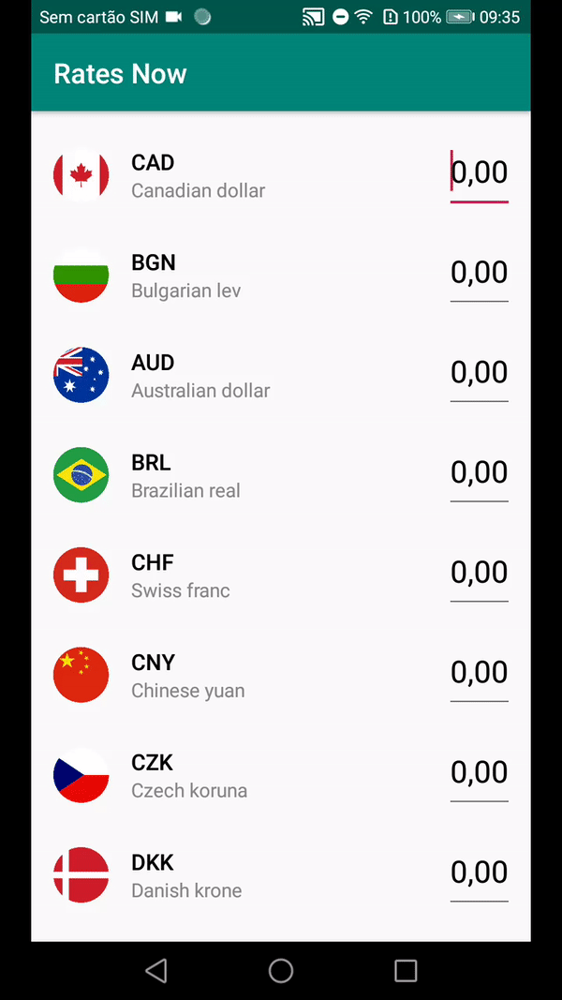
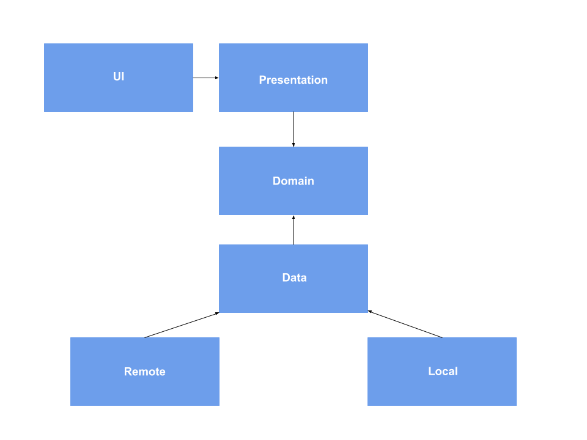

Rates Now Android app
=============================================

This project follows some of the principles of Clean Architecture.

It features:
* [Coroutines](https://kotlinlang.org/docs/reference/coroutines-overview.html)
* [Android Architecture Components](https://developer.android.com/topic/libraries/architecture)
* [Dagger](https://google.github.io/dagger/)
* [Room](https://developer.android.com/topic/libraries/architecture/room)
* [Retrofit](https://square.github.io/retrofit/)

* [Download the APK](rates-now-app-debug.apk)

UI/UX Requirements
------------------

- [X] Currencies and conversions working offline
- [X] Instant conversion without any remote request

TODOs
--------

- [ ] Limit the user input length
- [ ] Use smooth scrolling when a currency is selected
- [ ] Create a custom TextWatcher suitable for currencies need
- [ ] React to database changes accordingly
- [ ] Change ActionBar UI
- [ ] Add Android UI tests with Espresso
- [ ] Add unitary tests with Mockito
- [ ] Create multi-modules, one for each layer
- [ ] Better error handling, no internet connection feedback